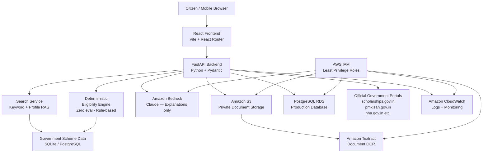

# AWS Architecture — SchemeSaathi AI

## Architecture Overview

## AWS Services Used

| Service | Purpose | Notes |
|---|---|---|
| **Amazon Bedrock** | LLM explanations via Claude | Only explains deterministic results — does not decide eligibility |
| **Amazon S3** | Secure document storage | Private buckets, no public ACL, presigned URLs only |
| **Amazon Textract** | Document OCR and text extraction | Classifies uploaded citizen documents |
| **Amazon RDS (PostgreSQL)** | Production database | SQLite for local dev |
| **Amazon CloudWatch** | Application logs and monitoring | Log group per environment |
| **AWS IAM** | Access control | Least-privilege roles per service |

## Security Principles

- **No public S3 buckets** — documents accessible via presigned URLs only (5-minute expiry)
- **IAM least privilege** — each service has a dedicated role with minimal permissions
- **No credentials in code** — all via environment variables / IAM instance profiles
- **Bedrock grounding** — system prompt prevents LLM from inventing scheme data
- **Input validation** — all user input validated via Pydantic models
- **CORS** — configured for specific frontend origin only in production

## Demo Mode

When `DEMO_MODE=true` (default for local dev):

| AWS Service | Demo Mode Behavior |
|---|---|
| Amazon Bedrock | Mock AI responses generated from deterministic eligibility results |
| Amazon S3 | Files saved locally to `backend/uploads/` directory |
| Amazon Textract | Filename-based document classification (regex pattern matching) |
| Amazon RDS | SQLite database (`schemesaathi.db`) |
